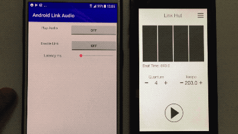

# AndroidLinkAudio

Bare minimum [Link](https://github.com/Ableton/link) integration within an Android audio App, using [Oboe](https://github.com/google/oboe) as the audio engine foundation.

## What the app does
Plays a click when a new bar starts. Also plays a sinewave just to make sure the audio engine is running properly.  When enabling Link, it joins a Link session, and the click should play in sync with other peers' start bar.

The latency slider sets the app output latency: on iOS, you can query the latency between the buffer timestamp and the actually time when it hits the speaker, which is required when syncing devices with Link. At the moment, this is done manually in the app, with this slider.

## Purpose of this repo
Serve as a spring board code for Android audio apps needing Ableton Link support. Similar to the LinkHut app on iOS.

## Pull requests welcome
I'm putting this code out hoping that you smart people out there can help out improving it. I'm trying to keep the API level somewhat low (currently 19).

Contributions on these are especially welcome:
- Latency calculation: how can the latency be set automatically? It seems there's some effort from the Oboe team for implementing this, but I'm not sure how to implement that for low API levels. Is it even possible?
- Link Session info: implement some C++ to Java callback to present alerts to the user when the peers count changes (like on iOS implementation).

## Building the app
see [notes from the non-audio test app](https://github.com/jbloit/androidLinkTest#building-the-app)
